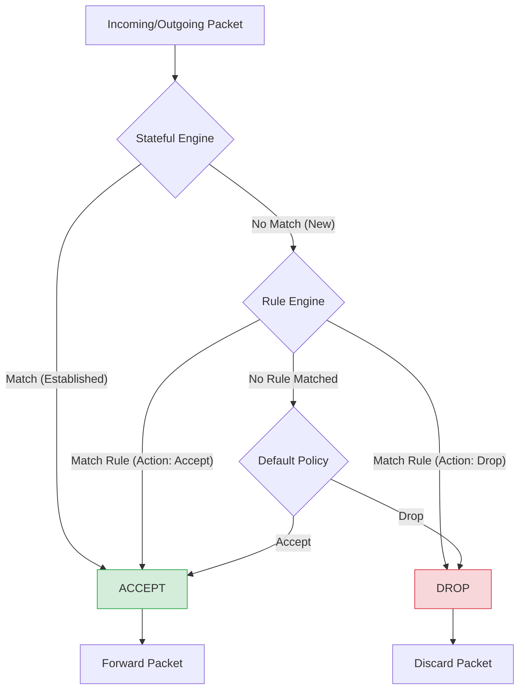

# 🔥 Rust Firewall Prototype

A high-performance, userspace stateful firewall written in Rust. This project demonstrates low-level network packet interception, deep packet inspection (DPI), and active rule enforcement using Linux Netfilter.

---

## 🚀 Key Features

- **Multi-Mode Operation:**
  - `sniff`: Passive observation mode (works on macOS & Linux).
  - `block`: Active enforcement mode using `nfqueue` (Linux only).
- **Stateful Inspection:** Automatically tracks TCP handshake states (SYN, SYN-ACK, ACK) to allow return traffic for established connections.
- **Top-Down Rule Engine:** Evaluates packets against a configurable TOML-based ruleset with default-deny/allow support.
- **Deep Packet Parsing:** Modular parser for Ethernet, IPv4, TCP, and UDP headers using the `pnet` library.
- **Structured Logging:** Records every decision into a searchable JSON audit log (`logs/firewall.log`) using the `tracing` framework.
- **Professional CLI:** Robust command-line interface built with `clap`, featuring subcommands and help documentation.

---

## 🛡️ What is a Firewall?

A firewall is a network security system that monitors and controls incoming and outgoing network traffic based on predetermined security rules. It acts as a gatekeeper between a trusted internal network and untrusted external networks (like the Internet).

### How it Works

This prototype implements two primary methods of packet inspection:

1.  **Stateless Packet Filtering:** Examines individual packets in isolation, looking at headers (source/destination IP, port, protocol) and matching them against a ruleset.
2.  **Stateful Inspection:** Tracks the state of active connections (e.g., TCP handshakes). If a packet belongs to an already established session, it can be automatically accepted, bypassing the rule engine for better performance and reliability.

### Packet Processing Flow

The following diagram illustrates how this firewall evaluates each packet:



---

## 🛠️ Architecture

The firewall is built with a modular, thread-safe architecture:

1.  **Capture Layer:** Utilizes raw sockets (via `pnet`) or `nfqueue` to intercept traffic.
2.  **Parser Layer:** Deconstructs raw bytes into typed Rust structures.
3.  **State Engine:** Maintains a thread-safe Hash Map of active conversations to bypass rule-matching for trusted traffic.
4.  **Rule Engine:** A deterministic matcher that compares packet attributes (IP, Port, Protocol) against the configuration.
5.  **Logger:** Asynchronous JSON writer for high-performance auditing.

---

## 📋 Prerequisites

### Linux (Required for Active Blocking)
```bash
sudo apt update
sudo apt install -y libpcap-dev libnetfilter-queue-dev iptables pkg-config build-essential
```

### macOS (Supported for Passive Sniffing)
```bash
brew install libpcap
```

---

## ⚙️ Installation

```bash
git clone https://github.com/your-username/rust-firewall.git
cd rust-firewall
cargo build --release
```

---

## 📖 Usage

### 1. View Help
```bash
./target/release/rust-firewall --help
```

### 2. List Active Rules
```bash
./target/release/rust-firewall rules list
```

### 3. Start Passive Sniffer (macOS/Linux)
Observe traffic and see what the firewall *would* do without actually dropping packets.
```bash
sudo ./target/release/rust-firewall start --mode sniff
```

### 4. Start Active Blocker (Linux Only)
To actually drop packets, you must first redirect traffic to the kernel queue:
```bash
# Redirect incoming traffic to queue #0
sudo iptables -I INPUT -j NFQUEUE --queue-num 0

# Start the firewall in block mode
sudo ./target/release/rust-firewall start --mode block
```
*Note: Always remember to clear your iptables rules when finished: `sudo iptables -F`*

---

## 🛡️ Rule Configuration

Rules are defined in `config/rules.toml`. The engine matches rules from **top to bottom**.

```toml
[defaults]
policy = "accept"   # Default policy: "accept" or "drop"

[[rules]]
name        = "Block Telnet"
direction   = "inbound"
protocol    = "TCP"
dst_port    = 23
action      = "drop"

[[rules]]
name        = "Block specific IP"
direction   = "inbound"
src_ip      = "192.168.1.100"
action      = "drop"

[[rules]]
name        = "Allow DNS"
direction   = "outbound"
protocol    = "UDP"
dst_port    = 53
action      = "accept"

[[rules]]
name        = "Allow HTTP/HTTPS"
direction   = "outbound"
protocol    = "TCP"
dst_port    = 80
action      = "accept"

[[rules]]
name        = "Allow HTTPS"
direction   = "outbound"
protocol    = "TCP"
dst_port    = 443
action      = "accept"
```

---

## 🧪 Testing

The project includes a comprehensive suite of integration tests covering parsing, rule matching, and TCP state transitions.

```bash
cargo test
```

---

## 📜 License

This project is licensed under the MIT License - see the [LICENSE](LICENSE) file for details.
